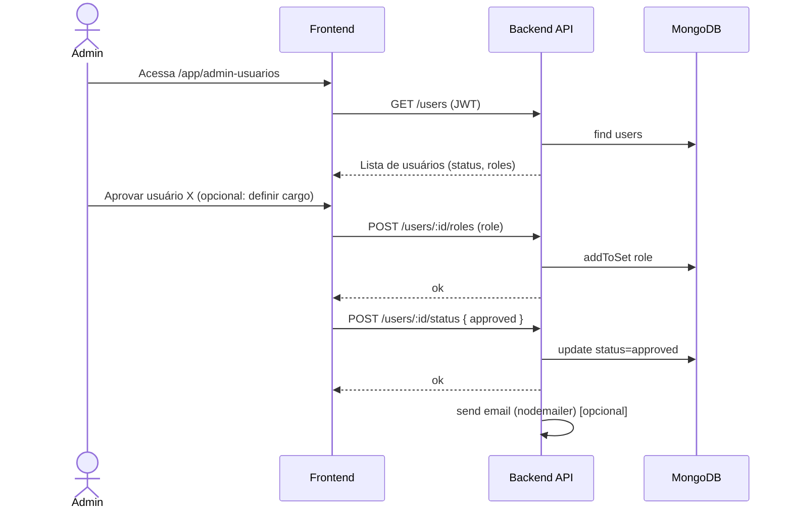
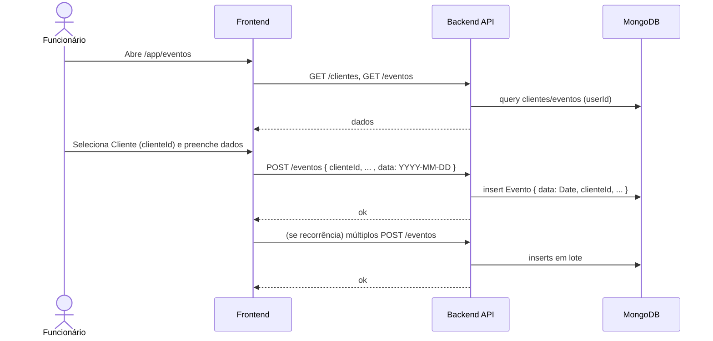
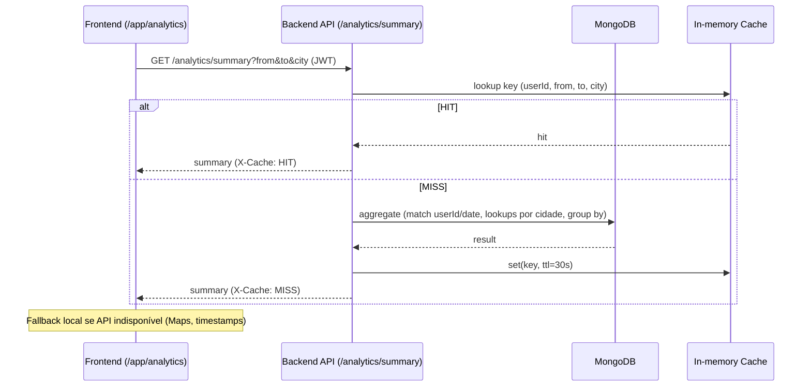
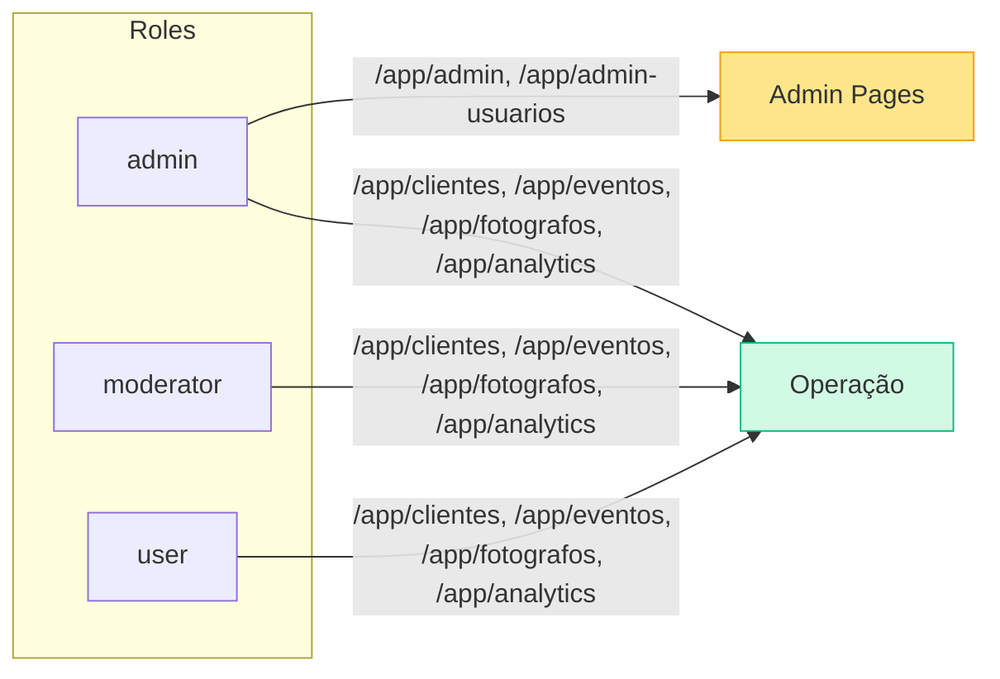
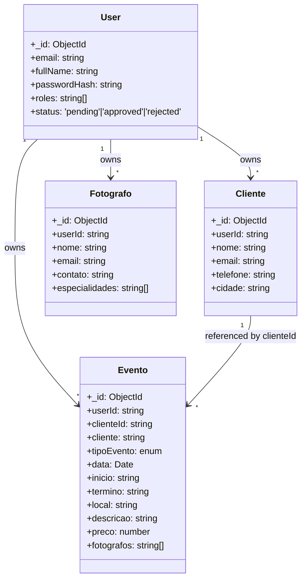

# Fluxo do Sistema Oliver

Este documento resume o fluxo ponta a ponta: do site público (landing) até a operação diária no CRM (clientes, eventos, fotógrafos, analytics), incluindo aprovação de usuários e papéis.

## Visão Geral do Fluxo (Landing → CRM)

```mermaid
flowchart LR
  subgraph Site Público
    A[/Home (/)\]
    B[/Sobre (/sobre)\]
    C[/Serviços (/servicos)\]
    D[/Fotos (/fotos)\]
    E[/Contato (/contato)\]
  end

  subgraph Autenticação
    L["/login"]
    R["/register"]
    RS["/register-success"]
  end

  subgraph CRM (Área Autenticada)
    direction LR
    ADM["/app/admin-usuarios\n(Gerenciar usuários/roles)"]
    CLI["/app/clientes\n(CRUD clientes)"]
    EVT["/app/eventos\n(CRUD eventos)"]
    FOT["/app/fotografos\n(CRUD fotógrafos)"]
    ANA["/app/analytics\n(Insights)"]
  end

  A --> E
  B --> E
  C --> E
  D --> E

  E -- CTA "Acessar CRM" --> L
  L --> |"Não tem conta?"| R --> RS

  R --> |Cria usuário (status: pending)| RS
  RS --> |Aguardar aprovação do admin| L

  L --> |Login (JWT) \nSe approved == true| CLI
  L --> |Se approved == false| RS

  ADM -. aprova/rejeita .-> L

  CLI --> EVT --> ANA
  FOT --> EVT
  CLI --> ANA
```

## Fluxo de Aprovação de Usuário (Admin)



## Fluxo de Criação de Evento (Funcionário)



## Analytics (Agregações + Cache)



## Papéis e Permissões



## Modelo de Dados (Simplificado)



## Regras de Negócio-Chave

- Registro cria `User` como `pending`; acesso às rotas `"/app/*"` somente após `approved`.
- Admin gerencia status e cargos em `/users` API, com proteção para não remover a própria role admin; e‑mail de aprovação opcional (SMTP).
- Eventos exigem `clienteId`; `data` persistida como `Date` no Mongo.
- Analytics usa agregações com índices e cache curto (30s); fallback local no FE.

## Melhorias Futuras

- Integrar `/contato` do site público a `/leads` no backend e tela de leads no CRM para conversão → cliente.
- Migrar exibição de eventos para usar sempre `clienteId` (já enviado) e retirar dependências do `cliente` (nome) em consultas.
- Adicionar cache distribuído (Redis) se necessário. 